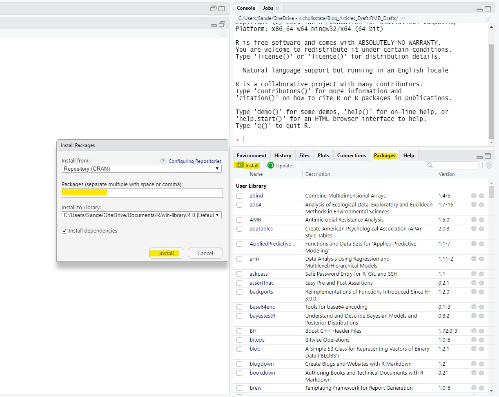
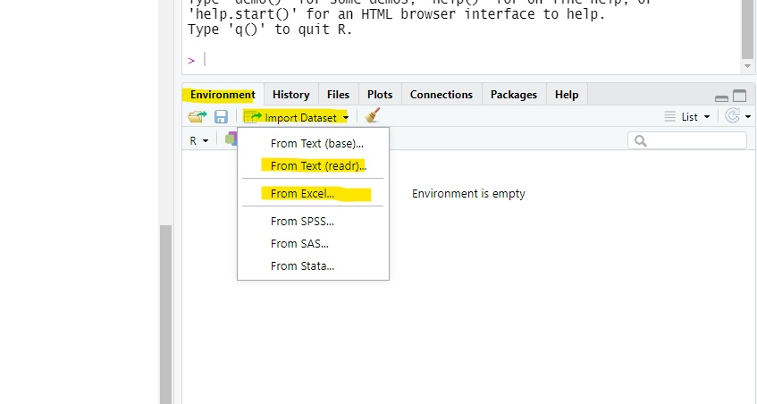
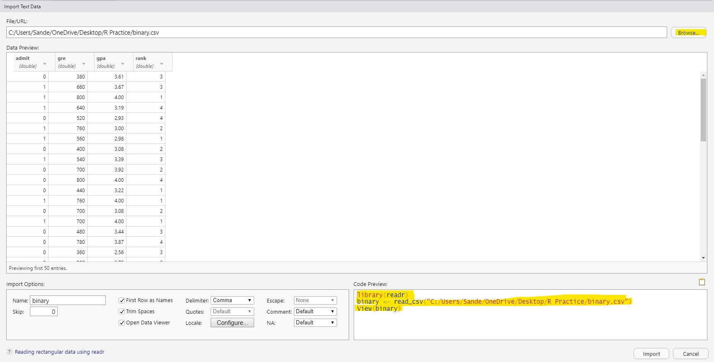

**Author: Sandesh Sharma**

### **Installing Packages and Libraries**

Libraries are the things that make R so powerful. It is the heart for all processes that take place in R studio. CRAN (The Comprehensive R Archive Network) has more than 10,000 packages^[1]^. I think libraries/packages in R are like pre-built function that can be used by anyone, so they do not have to write the code from bottom up. Some of the famous libraries-that you may have heard, are 'tidyverse', 'caret', 'ggplot' etc.

It's a two step process to use any packages in R-Studio.

**a. First, Install the Library**

Go to the R studio console and simply type *install.packages("library/package name").*

Another way to do the same thing is by drag & drop method.

Go to *Packages* tab on your panal then go to *install* option and type the package name that you want to install. Hit *Install* and your are set.

As you hit install button, you will see some wired stuff going in the R studio. It's just installing the packages.



**b. Load the Library**

After the installation, you have to load the library in order to use in your session/code/script. Go to your R file that you are about to write code. For instance, R-Markdown, R Script etc. and simply code :

*library(library name)* . Don't quote the library name this time like you did in *install.packages()*. Now, you are ready to use the power of your installed library/package.

### **Importing the data file**

You will come across different data file while working in data analytics. However, here I will explain the basic two file that are most common i.e. .csv (text/comma seperated file) and .xlsx (excel file). First of all I will mention the mouse-click method.

Go to the *Environment* tab on the panal and click the *Import Dataset* button. Chose what kind of data file your want to import.

After selecting the needed data file, a dialog box will pop up. *Browse* the file that you want to read. A preview of the file will show up. After that hit *Import* to load the file to use.

{width="600"}

The other way to do the same thing is copy the code from the *Code Preview* box. *Cancel* the dialog box and paste the code in your R script.



### **Finding the *NA***

NA or the empty data is the problem in any data analysis process. So, the NA should be removed or imputed using the respective methods. For that, we have to figure out how many NA's are there and in the file and as well as where they are.

To find how many of NA's are there we have to combine two functions as shown in the below code.

```{r}
#let's first make a dummy data

df <- data.frame(ID=c(1,2,3,NA,5),
                 var1=c("a",NA,NA,"d","e"),
                 var2=c(NA,"apple","orange",NA,NA))

#now let's find total missing value
sum(is.na(df))

#If you want to find out how many variable are missing in each column then:
library(purrr)
map(df, ~sum(is.na(.x))) #I will explain this method in separate blog post. 
```

### **Summary function**

*summary()* function is one code that's gives a lot of information to explore the data. This function is applied to the whole data frame/dataset. It will also show the number of missing value that we did above, making the process much easier.

```{r}
summary(df)
```

As shown in the output it will show every part of the descriptive statistics like min, max, median etc.

However, as you can see in the output it will not show the NA's for character class. Therefore, the we might have to use different method depending upon the dataset.

**References**

1.  <https://blog.revolutionanalytics.com/2017/01/cran-10000.html#:~:text=10%2C000%20R%20packages.-,Here's%20how%20to%20find%20the%20ones%20you%20need.,R%20packages%20available%20for%20download*>.
